# PROJECT 2 

[Project 2](https://bibi78.github.io/DiceGame/)

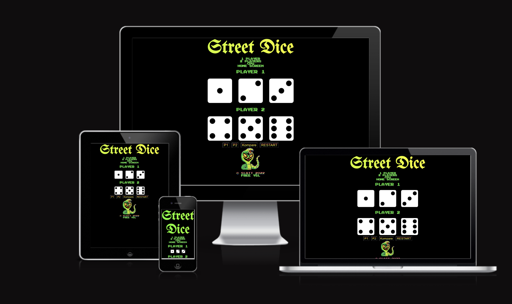

# Features / The Game 

This is classic American dice game played on the streets of New York City. 
The rules are simple, Roll 4 5 6 you win , 1 2 3 you lose and you must roll either 2 die the same and one different XXY, YYX, or all the same XXX, YYY to have a valid roll, then the scores are determined by who rolls the biggest number. So for example any combination of 4,5,6 is an automatic win, (5 4 6 , 6 4 5, are the same roll) and likewise  any combination of 1,2,3, is an automatic lose. Then Tripples are the next highest roll , so for example , 444 beats 446.  And then 446 beats 663 , its the single number that is counted and so on.
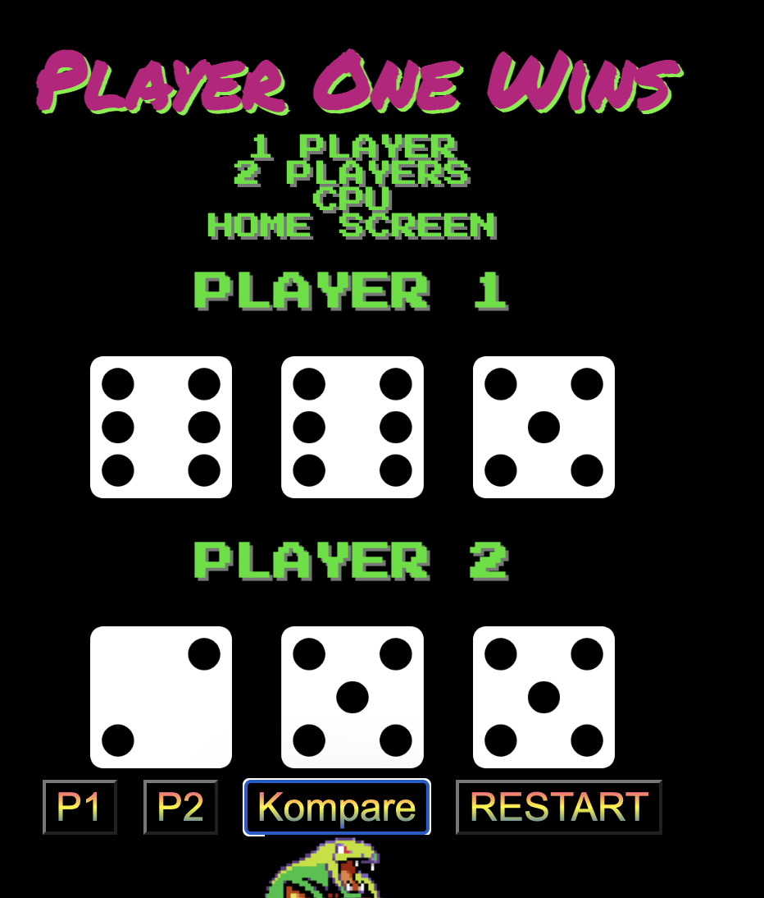

* This game is normally played between two people for money and I mainly focused on the "two player mode" and "cpu mode". You can roll die by yourself but it really doesnt make that much sense. I only added the "1 Player" option so two people could play against each other on seperate phones. But I mainly designed the game for 2 players.

1. Options 
* This game is up to two players or you can play against the CPU 
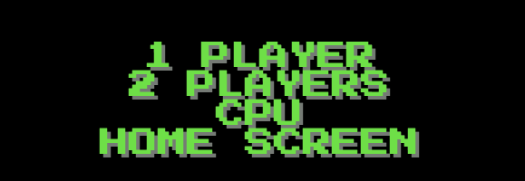

2. Styling 
* I styled the game in the 1980s 2-bit gaming fashion and tried to give a genuine 80s arcade game feel.
* I found the 2-bit font ("2-Player" in google fonts) first and that slowly inspired the rest of the project.
things kind of fell into place.
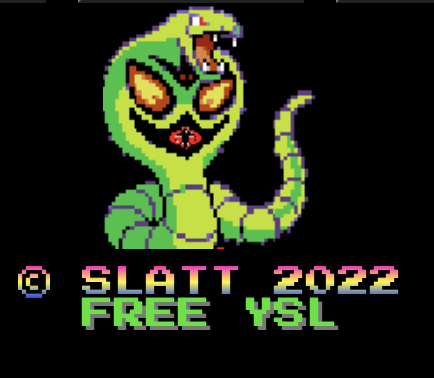
* The color way is supposed to invoke snakes and the like to give the game a street/ unfair look, like you playing dice with a snake.
3. Gradient
* I added this cool gradient feature to the title that gives it the effect of a flashing sign.
* 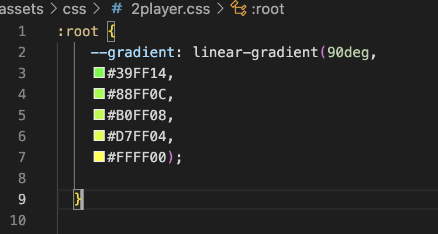
* 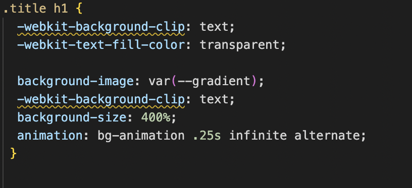

4. Cool Function
I. Roll/Kompare Fucntion 
* This function is essentially my whole project, you delete everyhting and leave this and I would be happy. This funtion "spin"/changes the die faces ,generates the random integers and compares the values. 
* 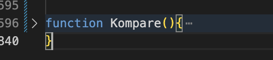

5. Snake Eyes 
* Depending on what the user rolls he or she will get a different dispaly at the top, the most common being "Snake Eyes"
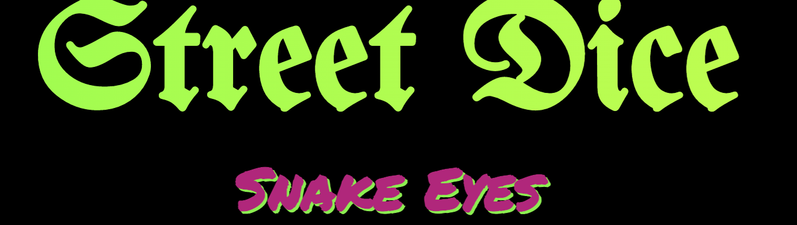

# Testing 
*The testing was difficult. I had a lot of bugs in my javascript I couldnt figure out. Actually I spent about five days on a problem with the "Roll" fucntion I created.
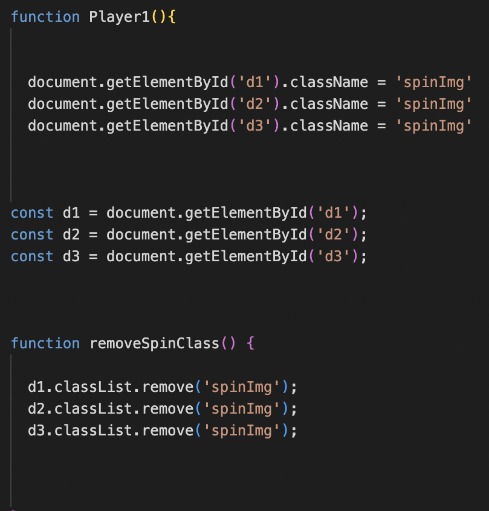
* Already this fucntion is a difficult to explain in words but makes sense in my head, in the beginning the dice would "roll" once and then not work again even though my fucntion worked well in the cosnole ( random number between 1-6 were generated but the image/dice face wouldnt change) so first I went to google , I thought something like this would was common place but I was wrong....kinda. I couldnt find the solution online so I wnet the tutors and they couldnt figure it out. I was not happy to say the least so I decided to rewrite my JS and just by placing certain variables at the top and elminatining CONST on things that are actualy going change it all wokred out but really was quite the headache.
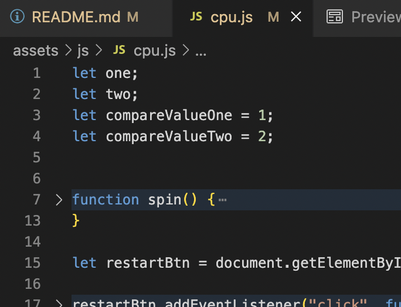

### HTML/CSS Validator
* No errors were returned when passing through the official CSS [W3 validator](https://jigsaw.w3.org/css-validator/validator?uri=https%3A%2F%2Fbibi78.github.io%2FDiceGame%2F&profile=css3svg&usermedium=all&warning=1&vextwarning=&lang=en) 
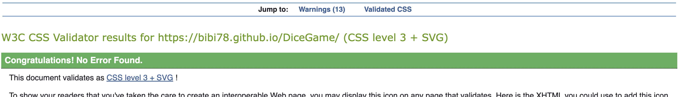

* No errors were returned when passing through the official HTML [W3 validator](https://validator.w3.org/nu/?doc=https%3A%2F%2Fbibi78.github.io%2FDiceGame%2F)

# Bugs
* All bugs have been fixed. I had a problem with an icon but a quick google search cleared it up.
* Problem & Solution
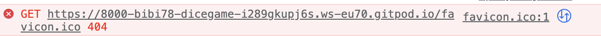
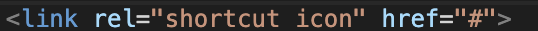

# Deployment

* The site was deployed using Github pages.
* All the directions given in the course video were followed.
* The site is linked here https://bibi78.github.io/DiceGame/

# Credits 
## Content
* The font came from [Google Fonts](https://fonts.google.com/about) .
* The changing die face img idea came from [YouTube](https://www.youtube.com/watch?v=B17NC5DD-dA&t=883s)
* The Gradient idea came from [YouTube](https://www.youtube.com/watch?v=f3mwKLXpOLk) as well. 
* The layout CSS I got the inspiration from the STREET FIGHTER game and page like [THIS](https://codepen.io/jkneb/pen/DRWdGg) & [THIS](https://dev.to/annlin/build-a-cool-thing-street-fighter-website-16j)

## Media 
* All images came from Google.

