[Project 2](https://bibi78.github.io/NewDiceGame/)

# PROJECT 2 
## Table of contents

- [STREET DICE](#project_2)
  - [Table of contents](#table-of-contents)
  - [Introduction](#introduction)
   - [How to play](#how-to-play)
   - [Note about game play](#note_about_game_play)
 - [Features](#features)
    - [Options](#options)
    - [Navigation](#navigation) 
    - [Rules](#rules)
    - [Styling](#styling) 
    - [Design](#design)
    - [Typography](#typography)
  - [Testing](#testing)
    - [HTML](#html)
    - [CSS](#css)
    - [Spread sheet](#spread-sheet)
    - [Java Script](#java-script)
    - [Individual Page Testing](#individual-page-testing)
  - [Bugs](#bugs)
    - [Bugs in CSS](#bugs-in-css)
    - [Bugs in Java Script](#bugs-in-java-script)
    - [Bugs in HTML](#bugs-in-html)
    - [Tutor suggestions](#tutuor-suggetions)
  - [Deployment](#deployment)
    - [Cloning and Forking](#cloning-and-forking)
    - [Local Deployment](#local-deployment)
    - [Remote Deployment](#remote-deployment)
  - [Media](#media)
  - [Credits and Acknowledgements](#credits)
  - [Additional Notes](#additional-notes)

# Introduction

This is classic American dice game played on the streets of New York City. 
The rules are simple, Roll 4 5 6 you win , 1 2 3 you lose and you must roll either 2 die the same and one different XXY, YYX, or all the same XXX, YYY to have a valid roll, then the scores are determined by who rolls the biggest number. So for example any combination of 4,5,6 is an automatic win, (5 4 6 , 6 4 5, are the same roll) and likewise  any combination of 1,2,3, is an automatic lose. Then Tripples are the next highest roll , so for example , 444 beats 446.  And then 446 beats 663 , its the single number that is counted and so on.

# HOW TO PLAY 
* This game is normally played between two people for money and I mainly focused on the "two player mode" and "cpu mode". You can roll die by yourself but it really doesnt make that much sense. I only added the "1 Player" option so two people could play against each other on seperate phones. But I mainly designed the game for 2 players.

* I have created a seperate page to explain the rules inside the project but I will also explain them here. 
* "The highest possible roll. If you roll 4–5–6, you automatically win. Rolling three same numbers is known as rolling a trip. Higher trips beat lower trips, so 4–4–4 is better than 3–3–3. Any trips beats any established point.Rolling a pair, and another number, establishes the singleton as a "point". A higher point beats a lower point, so 2–2–6 is better than 5–5–2. The lowest possible roll. If you roll 1–2–3, you automatically lose. Any other roll is a meaningless combination and must be rerolled until one of the above combinations occurs."
* The game is played in rounds , so each player rolls, compares values then a winner is decided and a new round is begun.

#  !NOTE ABOUT GAME PLAY !
* The way I have written the java script I have made it possible only to roll "valid" rolls, that is to say rolls that dont count such as , 6 3 4, or X,Y,Z are not present.
* So the two players roll each die and then compare (KOMPARE) who got the highest roll. 
* [WIKIPEDIA](https://en.wikipedia.org/wiki/Cee-lo#:~:text=The%20players%20roll%20the%20dice,-If%20the%20banker&text=Each%20player%20then%20rolls%20the,point%20lower%20than%20the%20banker's.)

# FEATURES
 # Options 
* This game is up to two players or you can play against the CPU 

 # Navigation
* Ive also added an enlarge effect to the navigation bar.
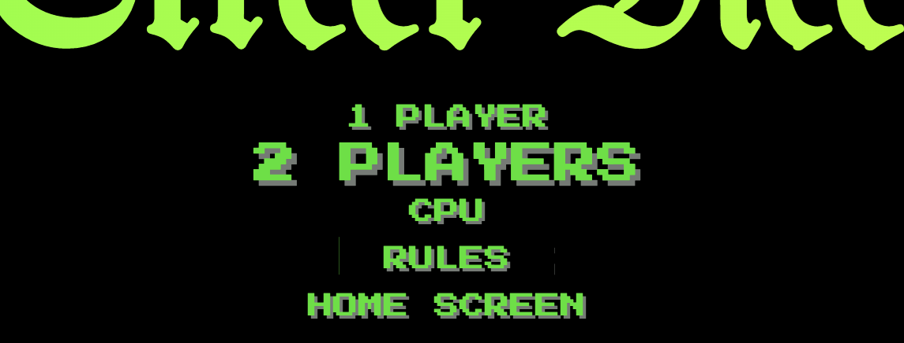
 # Rules
* The rules are explained here with no external links. 
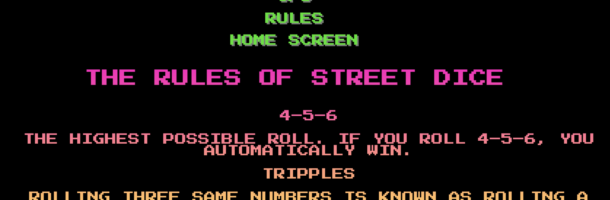

  # Styling 
* I styled the game in the 1980s 2-bit gaming fashion and tried to give a genuine 80s arcade game feel.
* I found the 2-bit font ("2-Player" in google fonts) first and that slowly inspired the rest of the project.
things kind of fell into place.
  # Design
* I wanted to keep evrything simple with the color scheme so as not to take away too much attetion from the game.
 The neon green & yellow I used throughout the project was just to make the game and the navigation, title  etc distinctly different from the dice.
* The color way is supposed to invoke snakes and the like to give the game a street/ unfair look, like you playing dice with a snake.
* Everything from the navigation to the color schemes is inspired by arcade games.

- Gradient
* I added this cool gradient feature to the title that gives it the effect of a flashing sign.
* 
* 
* the color schemes were chosen with the 1980s arcade-game-feel in mind. I wanted to make a "throwback" game to a time period I never experienced.
# Typography
* I used Google Font for the typography: I wanted to really invoke the "Street Fighter" feeling so choosing the fonts wasnt that complicated. I used the "Permanent Marker" font ( for that street tag feel) for the main title and the "Press Start 2P" for everything else.
* The very bottom where it says SLATT and FREE YSL are just names from rap music that I used to make the game seem more legit like "Nintendo 1988" or something you would see at the bottom of a arcade game screen. You can also click on SLATT 2022 to return to the homescreen but it is not very important.

- Cool Function
 - Roll/Kompare Fucntion 
* This function is essentially my whole project, you delete everyhting and leave this and I would be happy. This funtion "spin"/changes the die faces ,generates the random integers and compares the values. 
* 

- Snake Eyes 
* Depending on what the user rolls he or she will get a different dispaly at the top, the most common being "Snake Eyes"

# Testing 
* The testing was difficult. I had a lot of bugs in my javascript I couldnt figure out. Actually I spent about five days on a problem with the "Roll" fucntion I created.
* 
* Already this fucntion is a difficult to explain in words but makes sense in my head, in the beginning the dice would "roll" once and then not work again even though my fucntion worked well in the cosnole ( random number between 1-6 were generated but the image/dice face wouldnt change) so first I went to google , I thought something like this would was common place but I was wrong....kinda. I couldnt find the solution online so I wnet the tutors and they couldnt figure it out. I was not happy to say the least so I decided to rewrite my JS and just by placing certain variables at the top and elminatining CONST on things that are actualy going change it all wokred out but really was quite the headache.

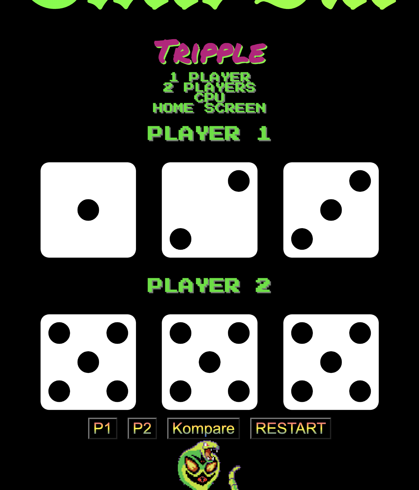

# Individual Page Testing 
`Home Page`

| Feature | Expected Outcome| Testing Performed | Result | Pass/Fail |
| --- | --- | --- | --- | --- |
| The Sites Title | Changes from neon yellow to neon green  | Looked at title | Title flashes from green to yellow | Pass |
| Navigation Effect | Enlarges when hovered over on | Hovered on button | Enlarges | Pass |

`Player 1 Page`
| Feature | Expected Outcome| Testing Performed | Result | Pass/Fail |
| --- | --- | --- | --- | --- |
| The Sites title | Changes from neon yellow to neon green  | Looked at title | Title flashes from green to yellow | Pass |
| Navigation Effect | Enlarges when hovered over on | Hovered on button | Enlarges | Pass |
| Dice spin | Spining of the dice | clicked button | dice spin| Pass|
|  Roll Player 1 Button | Rolls dice and displays result | Clicked on button | Spins and displays value | Pass |
| Restart Button | Resets the dice | Clicked on button | resets the dice | Pass |
| Display rolls | Display all four outcomes of dice rolls| Clicked on button | all outcomes attainable| Pass |

`Player 2 Page`
| Feature | Expected Outcome| Testing Performed | Result | Pass/Fail |
| --- | --- | --- | --- | --- |
| The Sites title | Changes from neon yellow to neon green  | Looked at title | Title flashes from green to yellow | Pass |
| Navigation Effect | Enlarges when hovered over on | Hovered on button | Enlarges | Pass |
| Dice spin effect | Spining of the dice | clicked button | dice spin| Pass|
|  Roll Player 1 Button | Rolls dice and displays result | Clicked on button | Spins and displays value | Pass |
| Restart Button | Resets the dice | Clicked on button | resets the dice | Pass |
|  Roll Player 2 Button | Rolls dice and displays result | Clicked on button | Spins and displays value | Pass |
| Kompare Button | compares the dice and displays winner | Clicked on button | compares the dice and displays winner | Pass |
| Display rolls | Display all four outcomes of dice rolls| Clicked on button | all outcomes attainable| Pass |

`CPU Page`
| Feature | Expected Outcome| Testing Performed | Result | Pass/Fail |
| --- | --- | --- | --- | --- |
| The Sites title | Changes from neon yellow to neon green  | Looked at title | Title flashes from green to yellow | Pass |
| Navigation Effect | Enlarges when hovered over on | Hovered on button | Enlarges | Pass |
| Dice spin effect | Spining of the dice | clicked button | dice spin| Pass|
|  Roll CPU Button | Rolls dice and displays result and compares values and displays winner | Clicked on button | Spins ,compares values and display winner | Pass |
| Restart Button | Resets the dice | Clicked on button | resets the dice | Pass |
| Display rolls | Display all four outcomes of dice rolls| Clicked on button | all outcomes attainable| Pass |

`Rules Page`
| Feature | Expected Outcome| Testing Performed | Result | Pass/Fail |
| --- | --- | --- | --- | --- |
| The Sites Title | Changes from neon yellow to neon green  | Looked at title | Title flashes from green to yellow | Pass |
| Navigation Effect | Enlarges when hovered over on | Hovered on button | Enlarges | Pass |

# Spread sheet
* I have also made a simple spread sheet deatailing which test were ran on which page. ALP1 stands for Automatic Loss PLayer 1 and AWP1 stands for Automatic Win Player 1 and so on and so forth with the 2 Player page and CPU and the other pages. These tests were just to mae sure every instance of gameplay was attainable. So for the Index/Home page and Rules page Ive written N/A for Non Apllicable because those functions arent available on those pages.
* The way I have written the java script for each page is slightly different so not all roll outcomes are displayed. In the case where the roll outcome is not displayed on purporse I have written N/A.
 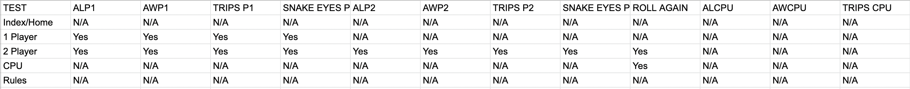 
 * Below I have provided images of all test working on the 1 player mode (Player 1) page.
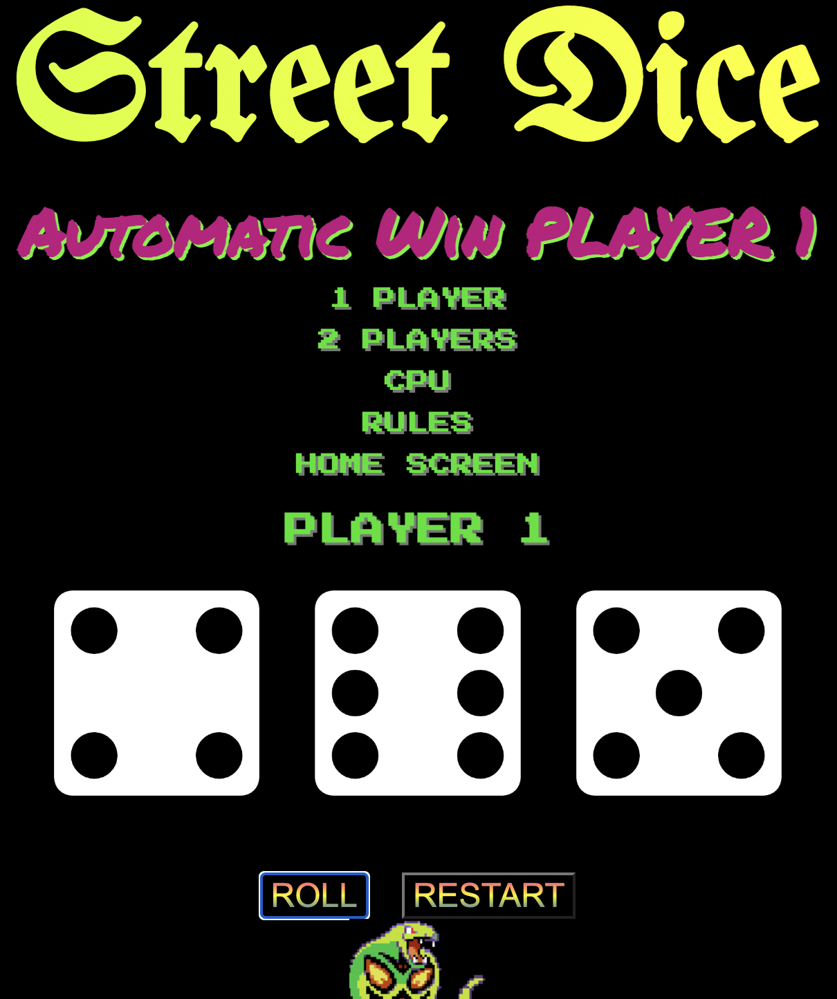 
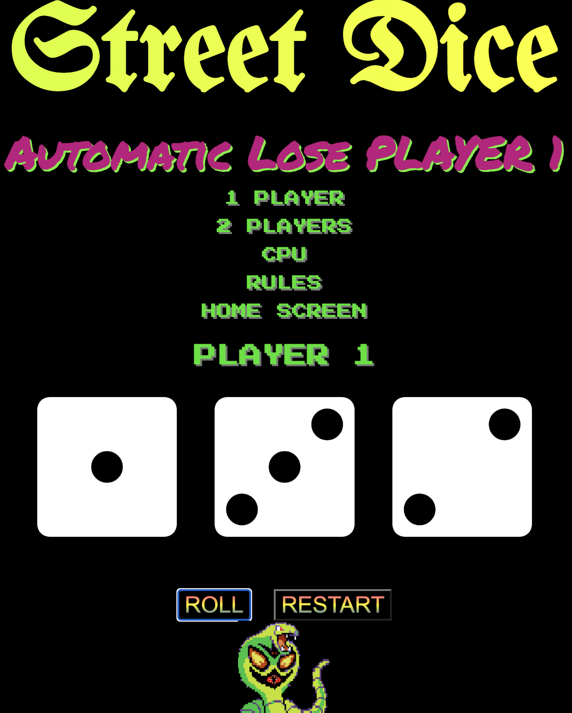 
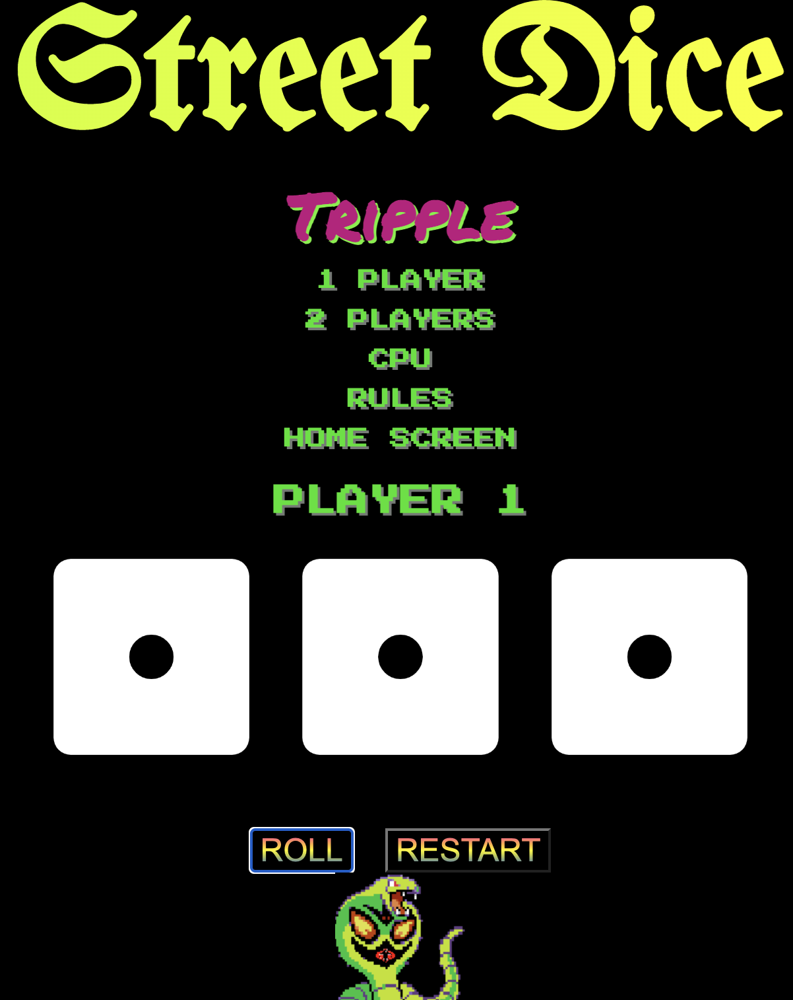 
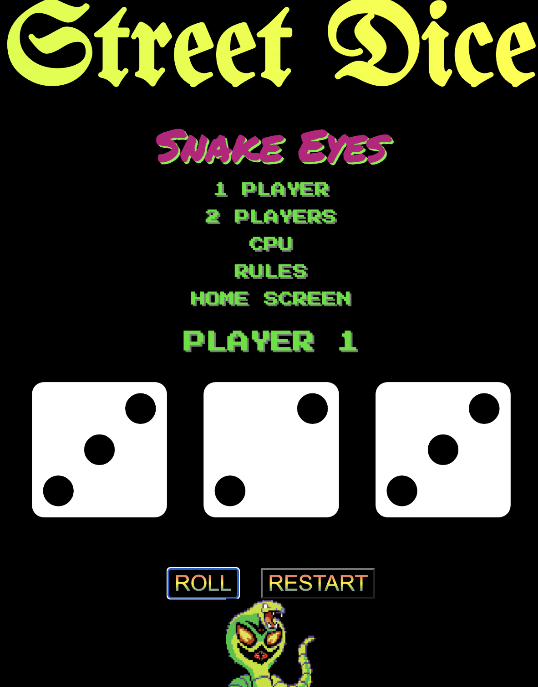

### HTML/CSS Validator & JS HINT
 # HTML 
  - Html passes with no errors [W3 validator](https://validator.w3.org/nu/?doc=https%3A%2F%2Fbibi78.github.io%2FNewDiceGame%2F). 
There is a warning for 3 of 5 page which I explain in the "Bugs" section.
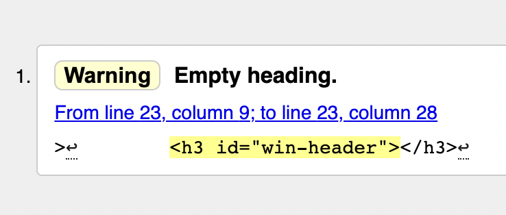
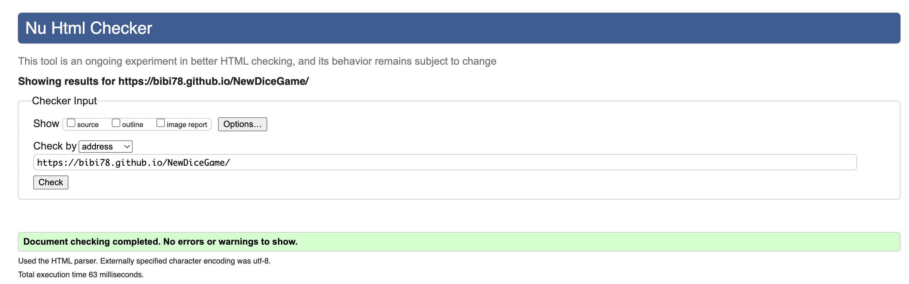

 # CSS
  - No errors were returned when passing through the official CSS [W3 validator](https://jigsaw.w3.org/css-validator/validator?uri=https%3A%2F%2Fbibi78.github.io%2FNewDiceGame%2F&profile=css3svg&usermedium=all&warning=1&vextwarning=&lang=en) 
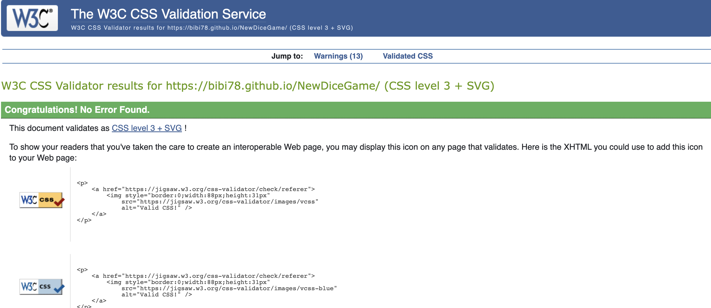
 - There are warninggs which I talk about in the  Bugs section below.

 # Java Script
  - JS Hint returned no errors. There are warnings though which I explain in the "Bugs" section.[JH Hint](https://jshint.com/) 
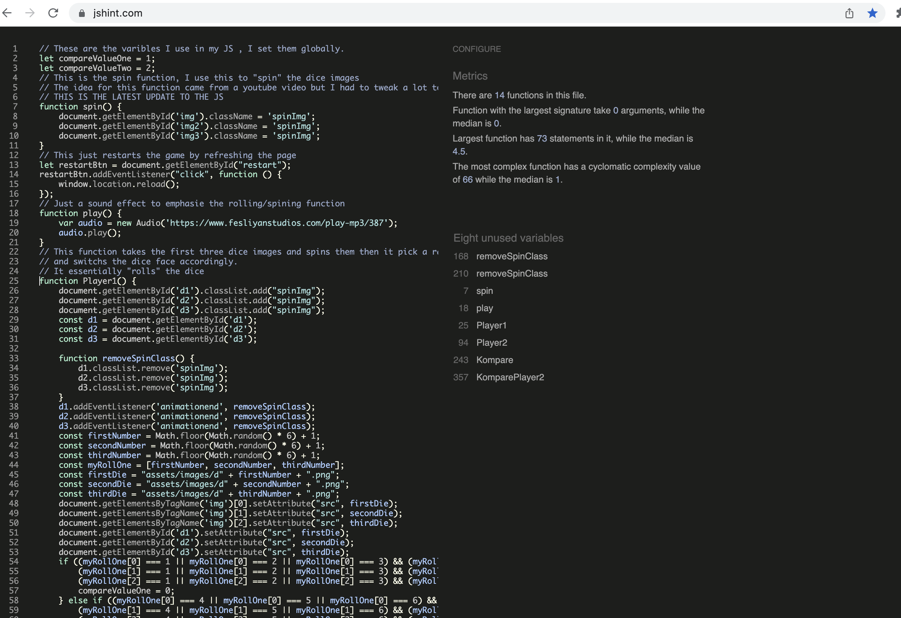
# Bugs
* Some of the "bugs" are intentional and are explained here. 
  # Bugs in Java Script.
  - This was an interesting bug to solve. At first I thought there was no way to remove this "warning" or "error" and this was just a matter of the way I wrote the code. I talked to the tutors and they said just make a note of it here in the README doc  and if eveything else is fine it should be fine. Then I palyed around a little more out of nervousness and anxiety of not wanting to fail this porject and found a work around. At first I thought because of the way I called my buttons in the HTML there was no way to remove the UNUSED VARIABLES error in the js hint. Since I heard somewhere that the javascript should all be in one file I felt stuck then I decided to just reuse my original idea and create seperate js files for each page and "call the buttons" inside those seperate files and problem solved. 
  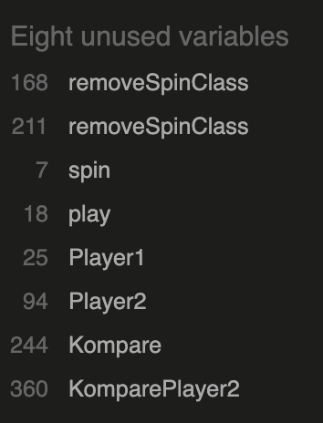
  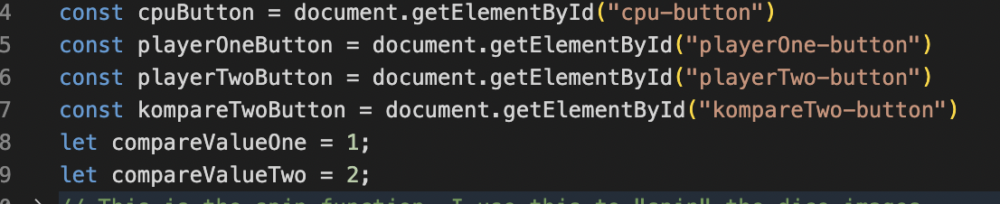
  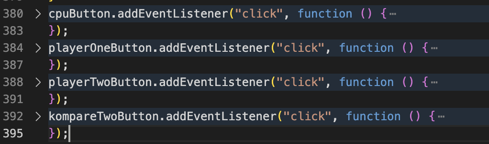

  - There was an error in the console for my rules and index page. In my head it seemed smarter to make seperate JS and CSS files for each page since there are not that many but I was told it is convetion to use the same js script for the whole project and so thats what I did. This problem was resolved by just taking out the JS file all together from these two pages since they really did need them. But I also coudlve created a new Js and removed the event listener that wasnt being used if I needed too.
  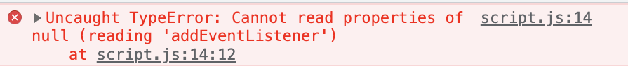

  # Tutuor suggetions
  - I was actually so stuck and freaked about this being a reason Id fail the project that I spoke to Code Institute Tutor about it. I Actually solved this problem myself and I talk about it up above in JS bugs section.
    * 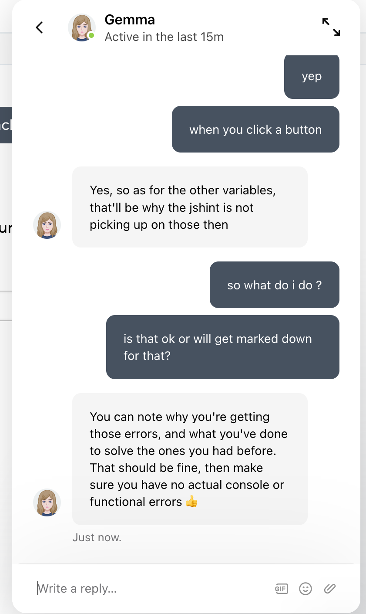
    * 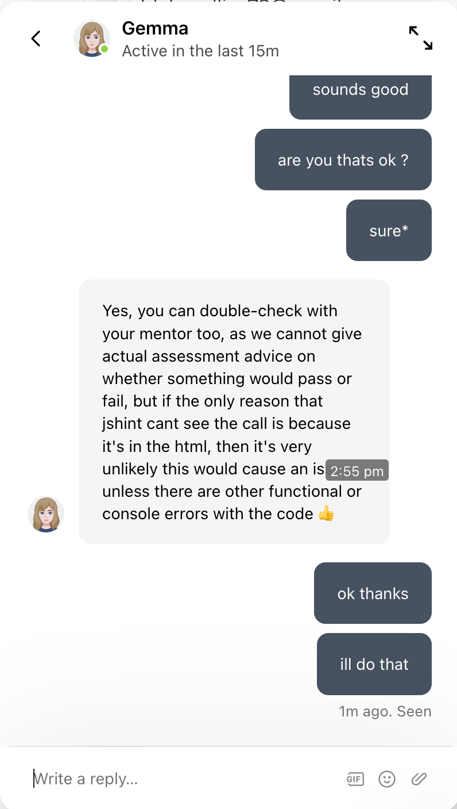

  - I also had this problem in the console which took a google search to solve.

# Bugs in CSS 

  - I also had a hard time settting the images width and height in CSS, while using the my spin function in javascript. So by setting the height and width in the html I got my code to work but I ended up with these errors. I fixed this problem by going into the javscript and reworking the code a little bit , instead of using className I use classList.add() and that solved the problem.
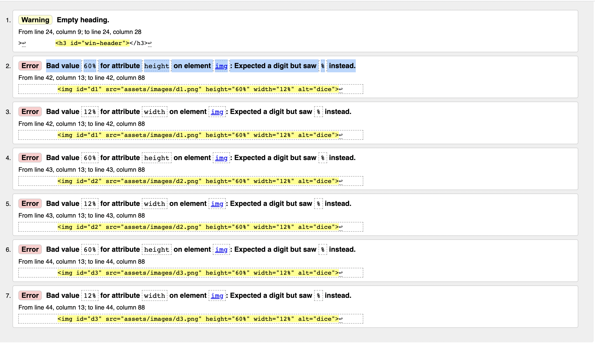

- I got these warnings which dont really effect anything but should be noted. 
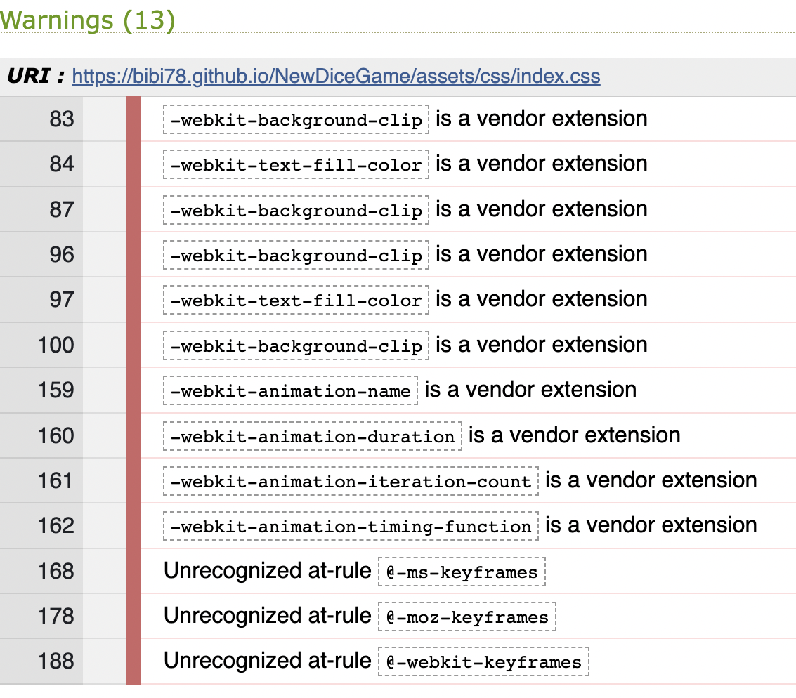

# Bugs in HTML
 - There is a warning in the validator but I need this empty header so I can later display the winner of each roll.

# Deployment
* The site was deployed using Github pages.
* All the directions given in the course video were followed.
* The site is linked here https://bibi78.github.io/NewDiceGame/

### Local Deployment

- Get to the  [Gitpod](https://gitpod.io/) site, then login with a Github account ,( you may need to download some things depending on what you already have on you computer), after you have opened your account return to this repository [REPO](https://github.com/BIBI78/NewDiceGame) , then click on green button to open and view the file.

### Remote Deployment
-  First choose a deployment application platform , prepare that application for deployment, that is to say make sure everythiing is configured so it works for you. Then connect using whatever deployment application you have chosen. You will need to have account of some sort normally to link up to the Github repository. After all that you can begin the deployment. Depending on which application you have chosen the steps might differ.

  ### Cloning and Forking 

- If someone would like to clone or fork this porject I suggest they refer to my earlier commits where the console logs are still used. Also the "mathematical logic" of each roll can get complicated so I suggest you play the game yourself a good amount first with the console logs to really see whats going on.  I encourgage anyone to try and play with the code. 

- It would interesting to see this game recreated and playable up to any number of players.

- If you would like to copy this code and improve it select the code tab on the repo page to copy or download the zip file.
- Forking does not seem to be availble in my current Github repo.

# Credits 
## Content
* The font came from [Google Fonts](https://fonts.google.com/about) .
* The changing die face image (In the JS code , it is the spin function)idea came from [YouTube](https://www.youtube.com/watch?v=B17NC5DD-dA&t=883s) 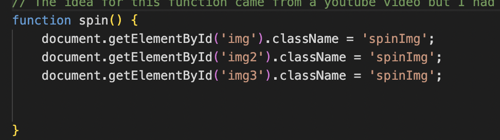
* The Gradient(In the CSScode it is used for the the title STREET DICE) idea came from [YouTube](https://www.youtube.com/watch?v=f3mwKLXpOLk) as well. 
* The layout CSS I got the inspiration from the STREET FIGHTER game and page like [THIS](https://codepen.io/jkneb/pen/DRWdGg) & [THIS](https://dev.to/annlin/build-a-cool-thing-street-fighter-website-16j)
* I got the outline for the testing individual pages from a Gitpod repo my mentor shared with me [HERE](https://github.com/kera-cudmore/TheQuizArms)

## Media 
* All images came from Google.
    - Snake Logo
        - I got the snake logo from a pokemon site [SNAKE](https://www.pngitem.com/middle/iRixhRJ_pokemon-arbok-hd-png-download/)
        - I also used a free website online to give all images used in this project a 2-bit arcade game effect [CONVERTER] (https://online-converting.com/image/convert2bmp/)
    - Dice 
        - I got the green die image from this site then I plugged it into the converter mentioned above [GREENDICE](https://www.fruugo.se/high-grade-acrylic-transparent-dice-six-sided-d6-19mm-casino-dice-set-of-5/p-141911577-300066108?language=en&ac=croud&asc=pmax&gclid=Cj0KCQiA0oagBhDHARIsAI-BbgdPfGSz0w88GazF0aIYcEVwm_2tIVY-bdKQt4D7gm6d8fvqyQRrcYEaAsLyEALw_wcB)
        -  The dice I use for the spinning effect I got from wikipedia [DICE](https://commons.wikimedia.org/wiki/Category:Dice_faces)

### ADDITIONAL NOTES ###
* In the CSS file I created seperate files for each html page so I could keep things neat.
* I created seperate JS files for the same reason mentioned above and I have included a library.js file that is not used but contains all the js for all pages just in case.
* It was difficult to keep up with all the coding convetions. 
* It should be noted that I removed the ability to roll "nonsense" rolls, that is to say rolls that make the player roll again and mean nothing. I thought including it would make things to confusing for the uninitiated and it seemed kind of redundant.

