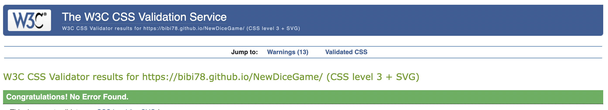
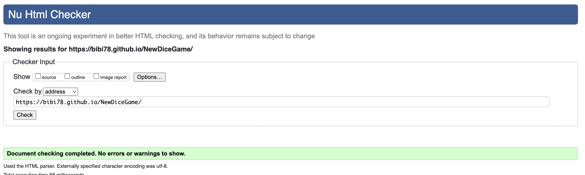

# PROJECT 2 

[Project 2](https://bibi78.github.io/NewDiceGame/)

# Features / The Game 

This is classic American dice game played on the streets of New York City. 
The rules are simple, Roll 4 5 6 you win , 1 2 3 you lose and you must roll either 2 die the same and one different XXY, YYX, or all the same XXX, YYY to have a valid roll, then the scores are determined by who rolls the biggest number. So for example any combination of 4,5,6 is an automatic win, (5 4 6 , 6 4 5, are the same roll) and likewise  any combination of 1,2,3, is an automatic lose. Then Tripples are the next highest roll , so for example , 444 beats 446.  And then 446 beats 663 , its the single number that is counted and so on.

# HOW TO PLAY 
* This game is normally played between two people for money and I mainly focused on the "two player mode" and "cpu mode". You can roll die by yourself but it really doesnt make that much sense. I only added the "1 Player" option so two people could play against each other on seperate phones. But I mainly designed the game for 2 players.

* I have created a seperate page to explain the rules inside the project but I will also explain them here. 
* "The highest possible roll. If you roll 4–5–6, you automatically win. Rolling three same numbers is known as rolling a trip. Higher trips beat lower trips, so 4–4–4 is better than 3–3–3. Any trips beats any established point.Rolling a pair, and another number, establishes the singleton as a "point". A higher point beats a lower point, so 2–2–6 is better than 5–5–2. The lowest possible roll. If you roll 1–2–3, you automatically lose. Any other roll is a meaningless combination and must be rerolled until one of the above combinations occurs."
#  !NOTE ABOUT GAME PLAY !
* The way I have written the java script I have made it possible only to roll "valid" rolls, that is to say rolls that dont count such as , 6 3 4, or X,Y,Z are not present.
* So the two players roll each die and then compare (KOMPARE) who got the highest roll. 
* [WIKIPEDIA](https://en.wikipedia.org/wiki/Cee-lo#:~:text=The%20players%20roll%20the%20dice,-If%20the%20banker&text=Each%20player%20then%20rolls%20the,point%20lower%20than%20the%20banker's.)

# FEATURES
1. Options 
* This game is up to two players or you can play against the CPU 

* Ive also added an enlarge effect to the navigation bar.

* The rules are explained here with no external links. 

2. Styling / Design 
* I styled the game in the 1980s 2-bit gaming fashion and tried to give a genuine 80s arcade game feel.
* I found the 2-bit font ("2-Player" in google fonts) first and that slowly inspired the rest of the project.
things kind of fell into place.
* The bright green I used throughout the project to really pop out at the user.
* The color way is supposed to invoke snakes and the like to give the game a street/ unfair look, like you playing dice with a snake.

3. Gradient
* I added this cool gradient feature to the title that gives it the effect of a flashing sign.
* 
* 
* the color schemes were chosen with the 1980s arcade-game-feel in mind. I wanted to make a "throwback" game to a time period I never experienced.
* The very bottom where it says SLATT and FREE YSL are just names from rap music that I used to make the game seem more legit like "Nintendo 1988" or something you would see at the bottom of a arcade game screen. You can also click on SLATT 2022 to return to the homescreen but it is not very important.

4. Cool Function
I. Roll/Kompare Fucntion 
* This function is essentially my whole project, you delete everyhting and leave this and I would be happy. This funtion "spin"/changes the die faces ,generates the random integers and compares the values. 
* 

5. Snake Eyes 
* Depending on what the user rolls he or she will get a different dispaly at the top, the most common being "Snake Eyes"

# Testing 
* The testing was difficult. I had a lot of bugs in my javascript I couldnt figure out. Actually I spent about five days on a problem with the "Roll" fucntion I created.
* 
* Already this fucntion is a difficult to explain in words but makes sense in my head, in the beginning the dice would "roll" once and then not work again even though my fucntion worked well in the cosnole ( random number between 1-6 were generated but the image/dice face wouldnt change) so first I went to google , I thought something like this would was common place but I was wrong....kinda. I couldnt find the solution online so I wnet the tutors and they couldnt figure it out. I was not happy to say the least so I decided to rewrite my JS and just by placing certain variables at the top and elminatining CONST on things that are actualy going change it all wokred out but really was quite the headache.

* I have also made a simple spread sheet deatailing which test were ran on which page. ALP1 stands for Automatic Loss PLayer 1 and AWP1 stands for Automatic Win Player 1 and so on and so forth with the 2 Player page and CPU and the other pages. These tests were just to mae sure every instance of gameplay was attainable. So for the Index/Home page and Rules page Ive written N/A for Non Apllicable because those functions arent available on those pages.
* The way I have written the java script for each page is slightly different so not all roll outcomes are displayed. In the case where the roll outcome is not displayed on purporse I have written N/A.
  
 * Below I have provided images of all test working on the 1 player mode (Player 1) page.
 
 
 

### HTML/CSS Validator
* No errors were returned when passing through the official CSS [W3 validator](https://jigsaw.w3.org/css-validator/validator?uri=https%3A%2F%2Fbibi78.github.io%2FDiceGame%2F&profile=css3svg&usermedium=all&warning=1&vextwarning=&lang=en) 

* No errors were returned when passing through the official HTML [W3 validator](https://validator.w3.org/nu/?doc=https%3A%2F%2Fbibi78.github.io%2FDiceGame%2F)

# Bugs
* Some of the "bugs" are intentional and are explained here. 
* Bug in the Java Script.
* The way I have written my Java Script 8 functions are called in the HTML when the user "clicks", this is intentional and just how the code works. I tried to find a way around it but I could not. This is the best I could do at this moment in time.

* I also had this problem in the console which took a google search to solve.

* I also had a hard time settting the images width and height in CSS, while using the my spin function in javascript. So by setting the height and width in the html I got my code to work but I ended up with these errors. I fixed this problem by going into the javscript and reworking the code a little bit , instead of using className I use classList.add() and that solved the problem.

* There is a warning in the validator but I need this empty header so I can later display the winner of each roll.

# Deployment

* The site was deployed using Github pages.
* All the directions given in the course video were followed.
* The site is linked here https://bibi78.github.io/NewDiceGame/

# Deployment Part 2/ Cloning and Forking 
* If someone would like to clone or fork this porject I suggest they refer to my earlier commits where the console logs are still used. Also the "mathematical logic" of each roll can get complicated so I suggest you play the game yourself a good amount first with the console logs to really see whats going on.  I encourgage anyone to try and play with the code. 

# Credits 
## Content
* The font came from [Google Fonts](https://fonts.google.com/about) .
* The changing die face image (In the JS code , it is the spin function)idea came from [YouTube](https://www.youtube.com/watch?v=B17NC5DD-dA&t=883s) 
* The Gradient(In the CSScode it is used for the the title STREET DICE) idea came from [YouTube](https://www.youtube.com/watch?v=f3mwKLXpOLk) as well. 
* The layout CSS I got the inspiration from the STREET FIGHTER game and page like [THIS](https://codepen.io/jkneb/pen/DRWdGg) & [THIS](https://dev.to/annlin/build-a-cool-thing-street-fighter-website-16j)

## Media 
* All images came from Google.

### SHOULD BE NOTED ###
* In the CSS file I created seperate files for each html page so I could keep things neat.
* I created seperate JS files for the same reason but all pages use the js script file. 

